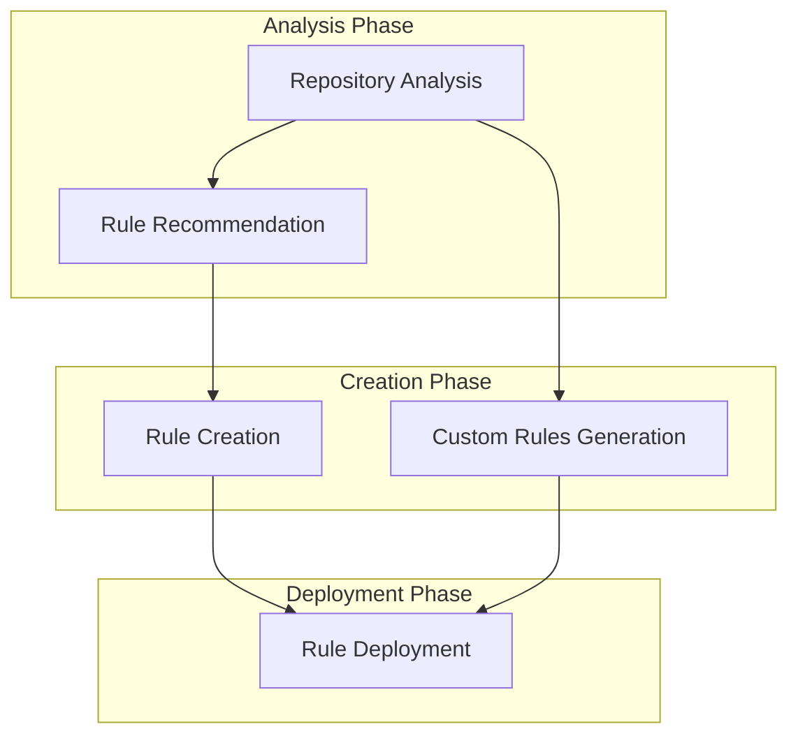
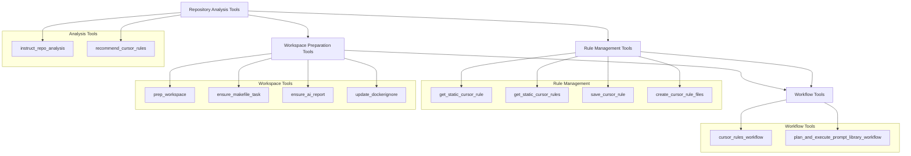
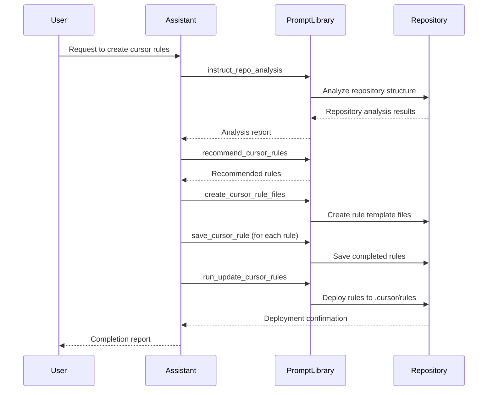
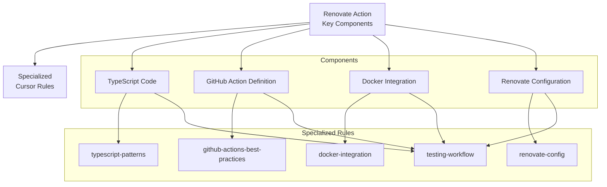

# Comprehensive Guide to Effective Prompting with Prompt Library

## Introduction

### What is the Model Context Protocol (MCP)?

Model Context Protocol (MCP) is a specification that enables AI assistants to use tools provided by external servers. It creates a standardized interface for AI assistants to interact with external systems, access contextual information, and perform actions outside their standard capabilities.

### Purpose of the `prompt_library` MCP Server

The `prompt_library` MCP server provides specialized tools for creating, managing, and deploying cursor rules within projects. Cursor rules are user-provided instructions that help AI assistants work more effectively with codebases by providing contextual guidance, best practices, and project-specific conventions.

The primary purpose of `prompt_library` is to:

- Analyze repositories to understand their structure, patterns, and technologies
- Generate appropriate cursor rules based on the analysis
- Manage the creation and deployment of these rules
- Streamline the integration of cursor rules into project workflows

### Benefits of Using `prompt_library` Tools

- **Automated Analysis**: Quickly analyze repositories to identify opportunities for cursor rules
- **Standardized Rules**: Generate consistent cursor rules based on best practices
- **Workflow Integration**: Seamlessly integrate cursor rules into existing development workflows
- **Improved AI Assistance**: Enhance AI assistants' effectiveness by providing project-specific context and conventions
- **Maintainable Standards**: Create living documentation of coding standards that evolve with the project

## Understanding Prompt Library Workflows

The `prompt_library` server offers several key workflows to help manage cursor rules throughout their lifecycle:



### Repository Analysis Workflow

This workflow involves analyzing a repository to understand its structure, technologies, and patterns. The analysis results provide insights that inform the creation of appropriate cursor rules.

Steps:

1. Run repository analysis using `instruct_repo_analysis`
2. Review the analysis report
3. Generate recommendations using `recommend_cursor_rules`

### Cursor Rules Creation Workflow

Based on the repository analysis, this workflow facilitates the creation of cursor rules tailored to the project's needs.

Steps:

1. Create cursor rule files using `create_cursor_rule_files`
2. Retrieve static rule templates using `get_static_cursor_rule` or `get_static_cursor_rules`
3. Customize the rules for the project
4. Save the completed rules using `save_cursor_rule`

### Cursor Rules Deployment Workflow

This workflow ensures that created cursor rules are properly deployed to the project's `.cursor/rules` directory.

Steps:

1. Prepare the workspace using `prep_workspace`
2. Ensure the Makefile has the necessary task using `ensure_makefile_task`
3. Update .dockerignore to exclude draft rules using `update_dockerignore`
4. Run the update-cursor-rules task using `run_update_cursor_rules`

### Custom Repository Rules Generation Workflow

For more advanced needs, this workflow generates custom cursor rules specifically tailored to the repository's unique characteristics.

Steps:

1. Run repository analysis using `instruct_repo_analysis`
2. Generate custom repository rules using `instruct_custom_repo_rules_generation`
3. Execute the complete workflow using `plan_and_execute_prompt_library_workflow`

## Prompt Library Tools Reference



### Repository Analysis Tools

#### `instruct_repo_analysis`

- **Description**: Runs a repository analysis to gather information for cursor rule creation
- **Inputs**:
  - `random_string`: Dummy parameter for no-parameter tools
- **Outputs**: Repository analysis results with information about the codebase structure, patterns, and technologies

#### `instruct_custom_repo_rules_generation`

- **Description**: Runs a cursor rules generation process based on repository analysis
- **Inputs**:
  - `report_path`: Path to the AI report file, relative to the project root (default: "ai_report.md")
- **Outputs**: Generated custom cursor rules based on the analysis

#### `recommend_cursor_rules`

- **Description**: Analyze a repository summary and recommend cursor rules to generate based on identified technologies and patterns
- **Inputs**:
  - `repo_summary`: A summary description of the repository, including technologies, frameworks, and key features
- **Outputs**: List of recommended cursor rules based on the repository summary

### Cursor Rule Management Tools

#### `get_static_cursor_rule`

- **Description**: Get a static cursor rule file by name to be written to the caller's .cursor/rules directory
- **Inputs**:
  - `rule_name`: Name of the cursor rule to retrieve (with or without .md extension)
- **Outputs**: Content of the specified cursor rule

#### `get_static_cursor_rules`

- **Description**: Get multiple static cursor rule files to be written to the caller's .cursor/rules directory
- **Inputs**:
  - `rule_names`: List of cursor rule names to retrieve (with or without .md extension)
  - `ignore_missing`: If True, missing rules will be skipped instead of returning errors (default: false)
- **Outputs**: Contents of the specified cursor rules

#### `save_cursor_rule`

- **Description**: Save a cursor rule to the cursor rules directory in the project
- **Inputs**:
  - `rule_name`: The name of the cursor rule file (without extension)
  - `rule_content`: The complete content of the cursor rule in mdc.md format
  - `overwrite`: Whether to overwrite the file if it already exists (default: true)
- **Outputs**: Confirmation of the saved cursor rule

#### `create_cursor_rule_files`

- **Description**: Create empty cursor rule files and provide instructions for sequential content creation
- **Inputs**:
  - `rule_names`: A list of cursor rule names to create (without file extensions)
- **Outputs**: Created empty cursor rule files and instructions for content creation

### Workspace Preparation Tools

#### `prep_workspace`

- **Description**: Prepare the workspace for cursor rules by returning natural language instructions
- **Inputs**:
  - `random_string`: Dummy parameter for no-parameter tools
- **Outputs**: Instructions for preparing the workspace

#### `ensure_makefile_task`

- **Description**: Ensure the Makefile has the update-cursor-rules task
- **Inputs**:
  - `makefile_path`: Path to the Makefile file, relative to the project root (default: "Makefile")
- **Outputs**: Confirmation that the Makefile has the required task

#### `ensure_ai_report`

- **Description**: Check for the existence of an AI report file and ensure its content aligns with requirements
- **Inputs**:
  - `report_path`: Path to the AI report file, relative to the project root (default: "./ai_report.md")
- **Outputs**: Confirmation of the AI report file status

#### `update_dockerignore`

- **Description**: Update the .dockerignore file to exclude the cursor rules drafts directory
- **Inputs**:
  - `random_string`: Dummy parameter for no-parameter tools
- **Outputs**: Confirmation that .dockerignore has been updated

#### `run_update_cursor_rules`

- **Description**: Run the update-cursor-rules Makefile task to deploy cursor rules
- **Inputs**:
  - `random_string`: Dummy parameter for no-parameter tools
- **Outputs**: Results of running the Makefile task

### Workflow Tools

#### `cursor_rules_workflow`

- **Description**: Execute the complete cursor rules workflow
- **Inputs**:
  - `rule_names`: A list of cursor rule names to create (without file extensions)
- **Outputs**: Results of the complete workflow execution

#### `plan_and_execute_prompt_library_workflow`

- **Description**: Execute a structured workflow for generating custom cursor rules based on repository analysis
- **Inputs**:
  - `repo_description`: Brief description of the repository's purpose and functionality
  - `main_languages`: Main programming languages used in the repository (comma-separated)
  - `file_patterns`: Common file patterns/extensions in the repository (comma-separated)
  - `key_features`: Key features or functionality of the repository (comma-separated)
  - `phase`: Current phase of the workflow (1-5) (default: 1)
  - `client_repo_root`: Absolute path to the client's repository root directory (default: "")
  - `workflow_state`: Current state of the workflow for continuing execution (default: null)
- **Outputs**: Results of the workflow execution and next steps

## Complete Cursor Rules Workflow

The following sequence diagram illustrates the complete process of using the `prompt_library` tools to create and deploy cursor rules:



## Example Prompts for Interacting with Prompt Library

### Example 1: Analyzing a Repository for Cursor Rule Recommendations

**Human**: "Could you analyze my repository and suggest appropriate cursor rules that would help with maintaining code quality and consistency?"

**AI Assistant**: "I'll analyze your repository to suggest cursor rules tailored to your project. First, let me run a repository analysis to understand your project structure.

[AI uses `instruct_repo_analysis` to analyze the repository]

Based on the analysis of your repository, I can see that you're working with a TypeScript project that includes GitHub Actions workflows and Docker configurations. Let me provide specific cursor rule recommendations based on this analysis.

[AI uses `recommend_cursor_rules` with the repository summary]

Based on the analysis, I recommend creating the following cursor rules for your project:

1. typescript-best-practices: Ensure consistent TypeScript patterns and coding standards
2. github-actions-workflow: Guidelines for maintaining GitHub Action workflows
3. docker-configuration: Standards for Docker file management
4. testing-standards: Ensure proper test coverage and testing practices
5. documentation-requirements: Guidelines for documenting your code and APIs

Would you like me to create these cursor rules for your project?"

### Example 2: Creating Cursor Rules for TypeScript Best Practices

**Human**: "I need cursor rules for TypeScript best practices in my project. Can you create those for me?"

**AI Assistant**: "I'll create cursor rules for TypeScript best practices in your project. Let me first prepare the workspace for cursor rules.

[AI uses `prep_workspace` to prepare the workspace]

Now I'll create the cursor rule file for TypeScript best practices.

[AI uses `create_cursor_rule_files` with rule_names=["typescript-best-practices"]]

Let me check if there's a static template for TypeScript best practices that we can use as a starting point.

[AI uses `get_static_cursor_rule` with rule_name="typescript-best-practices"]

I've retrieved a template for TypeScript best practices. Let me customize it for your project.

[AI customizes the rule content based on project needs]

Now I'll save the customized cursor rule to your project.

[AI uses `save_cursor_rule` with rule_name="typescript-best-practices" and the customized content]

The cursor rule has been created. Would you like me to deploy it to your .cursor/rules directory now?"

### Example 3: Deploying Cursor Rules to Project

**Human**: "I've created some cursor rules but need help deploying them to my project structure. Can you help with that?"

**AI Assistant**: "I'll help you deploy your cursor rules to the project structure. First, let me make sure your Makefile has the necessary task for updating cursor rules.

[AI uses `ensure_makefile_task` to check the Makefile]

I've confirmed that your Makefile has the update-cursor-rules task. Now let's make sure your .dockerignore file is properly configured to exclude the cursor rules drafts directory.

[AI uses `update_dockerignore` to update the .dockerignore file]

Now I'll run the update-cursor-rules task to deploy your cursor rules to the .cursor/rules directory.

[AI uses `run_update_cursor_rules` to deploy the rules]

Your cursor rules have been successfully deployed to the .cursor/rules directory. The AI assistants you work with will now follow these rules when helping you with your project."

### Example 4: Generating Custom Repository Rules Based on Project Analysis

**Human**: "My project has unique patterns and requirements. Can you generate custom cursor rules that specifically address my project's needs?"

**AI Assistant**: "I'll generate custom cursor rules specifically tailored to your project's unique patterns and requirements. Let me execute a complete workflow to analyze your repository and create custom rules.

[AI uses `plan_and_execute_prompt_library_workflow` with repository details]

I need to gather some information about your repository to create appropriate custom rules:

1. What is the main purpose and functionality of your repository?
2. What are the main programming languages used in your project?
3. What are the common file patterns or extensions in your repository?
4. What are the key features or functionality of your repository?

Once you provide this information, I'll generate custom cursor rules specifically designed for your project's unique characteristics."

**Human**: "The repository is a GitHub Action for automating dependency updates using Renovate. It's primarily written in TypeScript, with some shell scripts. Common file patterns include .ts, .sh, and .yaml files. Key features include Docker integration, GitHub Actions workflow, and Renovate configuration management."

**AI Assistant**: "Thank you for providing those details. I'll now generate custom cursor rules specifically for your GitHub Action that automates dependency updates with Renovate.

[AI uses `plan_and_execute_prompt_library_workflow` with:

- repo_description: "GitHub Action for automating dependency updates using Renovate"
- main_languages: "TypeScript, Shell"
- file_patterns: ".ts, .sh, .yaml"
- key_features: "Docker integration, GitHub Actions workflow, Renovate configuration management"]

I've analyzed your repository and created the following custom cursor rules:

1. typescript-patterns: Specific patterns for TypeScript code in GitHub Actions
2. github-actions-best-practices: Guidelines for developing and maintaining GitHub Actions
3. docker-integration: Standards for Docker integration in your action
4. renovate-config: Guidelines for Renovate configuration and integration
5. testing-workflow: Guidelines for testing and CI/CD workflows

The rules have been saved to your project. Would you like me to deploy them to your .cursor/rules directory now?"

### Example 5: Integrating Cursor Rules with Git Workflow

**Human**: "I'd like to integrate cursor rules with my Git workflow so that rules are automatically deployed when I push changes. Can you help set that up?"

**AI Assistant**: "I'll help you integrate cursor rules with your Git workflow for automatic deployment. We'll use a combination of prompt_library tools and Git tools to set this up.

First, let me ensure your Makefile has the update-cursor-rules task:

[AI uses `ensure_makefile_task` to check the Makefile]

Now let's examine your current Git workflow to understand how to integrate cursor rules deployment:

[AI uses `mcp_git_git_status` to check Git status]

I'll create a Git pre-push hook that will run the update-cursor-rules task automatically whenever you push changes. Here's how we'll set it up:

1. First, I'll create the hooks directory if it doesn't exist:

[AI uses `run_terminal_cmd` with command='mkdir -p .git/hooks']

2. Now I'll create the pre-push hook script:

[AI uses `edit_file` to create the pre-push hook script with the following content:

````
#!/bin/sh
# Pre-push hook to update cursor rules
make update-cursor-rules
exit 0
```]

3. Finally, I'll make the pre-push hook executable:

[AI uses `run_terminal_cmd` with command='chmod +x .git/hooks/pre-push']

Your Git workflow is now integrated with cursor rules. Whenever you push changes, the cursor rules will be automatically deployed to your .cursor/rules directory, ensuring your rules are always up to date."

## Recommendations for Using Prompt Library in This Project

Based on the structure and context of the renovate-action repository, here are specific recommendations for using the `prompt_library` tools:

### 1. Enhance Existing Cursor Rules

The project already has a `.cursor/rules/` directory, indicating that cursor rules are currently being used. You could use `prompt_library` tools to enhance these rules:

```mermaid
flowchart TD
    A[Analyze Existing Rules] --> B[Identify Improvement Opportunities]
    B --> C[Create Enhanced Rules]
    C --> D[Deploy Updated Rules]

    subgraph "Analysis"
    A
    B
    end

    subgraph "Enhancement"
    C
    end

    subgraph "Deployment"
    D
    end
````

- Use `instruct_repo_analysis` to analyze the current repository structure and technologies
- Compare existing rules with recommended rules using `recommend_cursor_rules`
- Create additional rules or enhance existing ones focusing on:
  - TypeScript patterns specific to GitHub Actions
  - Docker integration best practices
  - Renovate configuration guidelines
  - GitHub Actions workflow patterns

### 2. Automate Rule Deployment

The project has a Makefile, which could be enhanced to automate cursor rule deployment:

```mermaid
flowchart LR
    A[Git Commit] --> B[Pre-Commit Hook]
    B --> C[Run update-cursor-rules]
    C --> D[Deploy to .cursor/rules]

    subgraph "Git Workflow"
    A
    B
    end

    subgraph "Automated Deployment"
    C
    D
    end
```

- Use `ensure_makefile_task` to add or update the cursor rule deployment task
- Create Git hooks that automatically run the deployment task on commit or push
- Consider adding cursor rule validation to your CI/CD pipelines

### 3. Create Specialized Rules for Renovate Action

Based on the project's focus, consider creating specialized cursor rules:



- Create rules specifically for GitHub Action input/output validation
- Develop rules for maintaining Renovate configuration best practices
- Implement rules for Docker image optimization
- Add rules for TypeScript patterns specific to GitHub Actions

## Strategic Follow-up Questions

### 1. "How can I customize the repository analysis process to focus on specific aspects of my codebase, such as GitHub Action workflow patterns or TypeScript architectural patterns?"

This question explores advanced customization of the repository analysis process to generate more targeted rules. Understanding how to focus the analysis on specific aspects of your codebase would allow you to create more precise and effective cursor rules.

### 2. "What strategies would you recommend for versioning cursor rules alongside code changes to ensure rules evolve with the codebase?"

This question delves into the maintenance aspect of cursor rules. As your codebase evolves, your cursor rules should evolve as well. Understanding versioning strategies would help ensure your rules remain relevant and effective over time.

### 3. "How can I integrate cursor rule validation into my CI/CD pipeline to ensure all team members adhere to the established coding standards?"

This question explores how to enforce cursor rules as part of your continuous integration process. Integrating rule validation into your CI/CD pipeline would help ensure consistent code quality and adherence to established standards across your team.

## Resources and References

- [Model Context Protocol Documentation](https://modelcontextprotocol.io/)
- [GitHub Actions Documentation](https://docs.github.com/en/actions)
- [TypeScript Best Practices](https://www.typescriptlang.org/docs/handbook/declaration-files/do-s-and-don-ts.html)
- [Renovate Documentation](https://docs.renovatebot.com/)
- [Docker Best Practices](https://docs.docker.com/develop/develop-images/dockerfile_best-practices/)
