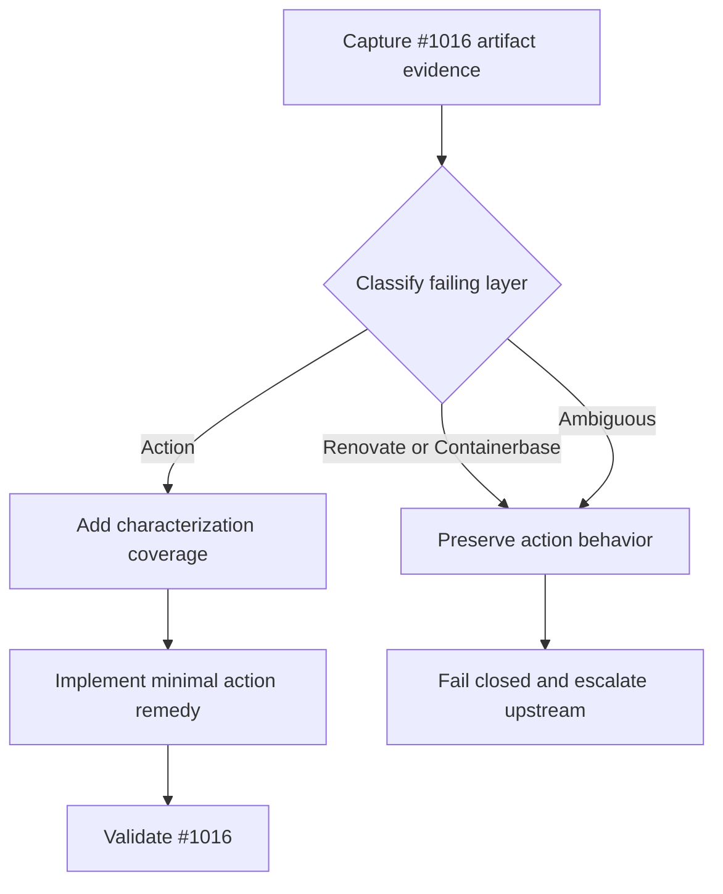

## Overview

Resolve the `renovate/artifacts` Bun failure reported in #3436 without replacing Renovate's constrained Bun provisioning with a global-Bun workaround. The work begins by classifying the responsible layer, then changes this action only if that evidence identifies an action-owned seam.

## Problem Frame

`fro-bot/agent#1016` produced the expected `bun.lock` change and passed normal CI, but Renovate reported `Command failed: install-tool bun 1.3.14`. The composite action preinstalls Bun while `action.yaml` forces Renovate's `binarySource=install`, so the failure may be in the wrapper, Renovate, or Containerbase. The action must not hide an upstream failure with a global fallback. See origin: `docs/brainstorms/2026-08-24-bun-artifact-integration-requirements.md`.

## Requirements Trace

- R1. Preserve Renovate's requested Bun version for artifact generation.
- R2. Do not use global Bun as a remedy.
- R3. Leave non-Bun artifact behavior unchanged.
- R4. Classify the action, Renovate, or Containerbase as the failing layer before changing behavior.
- R5. Validate the selected remedy against `fro-bot/agent#1016` with green artifact status and normal CI.
- R6. Fail closed and escalate when the failure is upstream or an action remedy is unproven.

## Scope Boundaries

- Do not make `binarySource=global` the default or an automatic fallback.
- Do not modify Renovate or Containerbase internals in this repository.
- Do not add a new diagnostics feature or broaden into artifact-manager refactoring.
- Do not change action behavior unless classification identifies an action-owned failure.

## Context & Research

### Relevant Code and Patterns

- `action.yaml` forces `RENOVATE_BINARY_SOURCE=install`, supplies protected Renovate configuration, and invokes `renovatebot/github-action` with `docker/entrypoint.sh`.
- `docker/entrypoint.sh` installs a fixed global Bun release, then runs Renovate as `ubuntu`.
- `src/__tests__/action-config.test.ts` statically characterizes action configuration and protected command/config invariants; it is the existing regression-test location for `action.yaml` behavior.
- `.github/filters.yaml` and `.github/workflows/main.yaml` already classify `action.yaml` and `docker/**` changes for the action's CI paths.

### Institutional Learnings

- The runtime belongs in `action.yaml` and `docker/entrypoint.sh`, not the TypeScript scaffold.
- The action is intentionally a thin wrapper over Renovate; do not replicate Renovate or Containerbase behavior locally.
- Previous Bun archive and `bunx` fixes are relevant history, but they do not establish that the current failure is entrypoint-owned.

### External References

- `renovatebot/renovate@44.30.0` Bun artifact handling uses constrained tool provisioning when `binarySource=install`.
- Containerbase owns dynamic Bun acquisition for that path.

## Prior-Art Survey

```json
{
  "schema_version": 2,
  "verdict": "unresolved",
  "scope": "repository root",
  "freshness": {
    "vcs_reference": "7ed55075611c615e67c8d23ed29da781abff0bee7"
  },
  "budget": {
    "max_search_passes": 3,
    "max_candidate_inspections": 3,
    "exhausted": true
  },
  "candidates": [
    {
      "path_or_symbol": "action.yaml",
      "description": "Configures Renovate binary installation mode and invokes the Docker entrypoint.",
      "disposition": "undispositioned"
    },
    {
      "path_or_symbol": "docker/entrypoint.sh",
      "description": "Installs the global Bun runtime and prepares the Renovate execution environment.",
      "disposition": "undispositioned"
    },
    {
      "path_or_symbol": "src/__tests__/action-config.test.ts",
      "description": "Characterizes static action configuration but cannot establish runtime artifact ownership.",
      "disposition": "insufficient",
      "insufficiency_reason": "Static extraction cannot distinguish action, Renovate, and Containerbase runtime failures."
    }
  ],
  "acceptance": {
    "accepted_by_user": true,
    "accepted_verdict": "unresolved",
    "reason": "Proceed with a decision-gated fix plan: classify ownership first, then implement only an action-owned remedy."
  }
}
```

## Key Technical Decisions

- KTD1. **Classification gates behavior changes.** Preserve the existing runtime until evidence identifies an action-owned failure; upstream and ambiguous failures remain fail-closed.
- KTD2. **Constrained provisioning is an invariant.** Do not trade requested-version correctness for a broad `binarySource=global` workaround.
- KTD3. **`fro-bot/agent#1016` is the external acceptance case.** Record the exact revision, update group, requested Bun version, artifact status, and normal-CI result before relying on it as proof.
- KTD4. **Characterize before changing shell runtime behavior.** Start with regression coverage for action-owned invariants, then add the smallest targeted runtime change only when classification supports it.

## Open Questions

### Resolved During Planning

- Is a global Bun fallback acceptable? No; it violates the origin requirements.
- Should unrelated artifact managers change? No; preserve their current behavior.

### Deferred to Implementation

- Which precise failure signature distinguishes the wrapper from Renovate or Containerbase? It requires the representative runtime evidence.
- Which exact `fro-bot/agent#1016` revision and update group form the acceptance case? It must be captured before a remedy is selected.
- If the action owns the defect, which narrow environment, permission, cache, or binary-path change corrects it? The answer depends on classification evidence.

## High-Level Technical Design

> _This illustrates the intended approach and is directional guidance for review, not implementation specification. The implementing agent should treat it as context, not code to reproduce._



## Implementation Units

### U1. Capture the representative failure and classify ownership

- **Goal:** Establish a reproducible evidence record for `fro-bot/agent#1016` and decide whether this action can affect the failing provisioning path.
- **Requirements:** R1, R2, R4, R5, R6.
- **Dependencies:** Access to the representative consumer update and its Renovate artifact result.
- **Files:**
  - Modify: `src/__tests__/action-config.test.ts`
  - Inspect: `action.yaml`
  - Inspect: `docker/entrypoint.sh`
- **Approach:** Record the exact consumer revision, update group, requested Bun version, artifact failure output, and normal CI result. Contrast that evidence with the action's forced binary source, entrypoint environment, user transition, cache preparation, and Bun path. Extend the existing action-config test with the invariants that must remain true while classification runs: `binarySource=install` stays enforced and no global fallback is introduced.
- **Execution note:** Add the characterization assertion before modifying runtime behavior.
- **Patterns to follow:** `src/__tests__/action-config.test.ts` extraction and configuration-invariant tests; `bash -Eeuo pipefail` shell behavior in runtime files.
- **Test scenarios:**
  - **Happy path:** extracted action configuration retains `RENOVATE_BINARY_SOURCE=install`.
  - **Regression:** no action configuration path introduces `binarySource=global` or rewrites the selected Bun version.
  - **Integration:** representative evidence names the exact artifact failure and distinguishes it from normal CI failure.
- **Verification:** Classification records the responsible layer or explicitly marks it ambiguous; static invariants remain covered.

### U2. Apply a minimal action-owned remedy only when classification supports it

- **Goal:** Correct the action's specific provisioning seam without affecting Renovate's requested-version semantics or other package managers.
- **Requirements:** R1, R2, R3, R4, R6.
- **Dependencies:** U1 must classify the action as the responsible layer. If it does not, do not modify runtime behavior; proceed to U3's upstream disposition.
- **Files:**
  - Modify as classified: `action.yaml` and/or `docker/entrypoint.sh`
  - Modify: `src/__tests__/action-config.test.ts`
  - Modify only if validation coverage needs a workflow hook: `.github/filters.yaml`, `.github/workflows/main.yaml`
- **Approach:** Change only the classified action-owned input, environment, permission, cache, or executable-path seam. Keep Renovate's constrained dynamic tool path intact, scope any environment adjustment to the Bun artifact execution boundary, and avoid changing non-Bun managers. Do not add a global-Bun fallback.
- **Execution note:** Implement the classified contract test-first; do not edit the entrypoint on a hypothesis.
- **Patterns to follow:** protected configuration handling in `action.yaml`; installation and privilege transitions in `docker/entrypoint.sh`; existing path filtering in `.github/filters.yaml`.
- **Test scenarios:**
  - **Happy path:** the requested Bun version remains on Renovate's constrained provisioning path.
  - **Regression:** non-Bun manager configuration and command allowlists are unchanged.
  - **Error path:** provisioning failure does not select global Bun or silently alter action behavior.
  - **Integration:** the remedy produces the expected classified behavior in the representative consumer run.
- **Verification:** Focused regression coverage passes, action validation paths cover the touched runtime files, and the representative update advances to green artifact status only when the action-owned remedy is proven.

### U3. Validate the disposition against the consumer and preserve the boundary

- **Goal:** Prove the action remedy on the representative consumer or document an upstream disposition without shipping speculative behavior.
- **Requirements:** R3, R5, R6.
- **Dependencies:** U1; U2 only when ownership is action-level.
- **Files:**
  - Modify: `docs/brainstorms/2026-08-24-bun-artifact-integration-requirements.md` only if the final evidence materially changes its recorded disposition.
  - Modify: `docs/plans/2026-08-24-001-fix-bun-artifact-provisioning-plan.md` only to mark completed units and record the final disposition.
- **Approach:** Re-run or observe the exact `fro-bot/agent#1016` case using the captured revision and update shape. If an action-owned remedy is green, confirm normal CI and artifact status while preserving constrained Bun. If ownership is upstream or remains ambiguous, leave action behavior unchanged and prepare the bounded upstream evidence rather than adding a workaround.
- **Patterns to follow:** existing issue evidence style and the action's fail-closed configuration boundaries.
- **Test scenarios:**
  - **Integration:** the captured consumer update has green normal CI and artifact status after an action-owned remedy.
  - **Error path:** an upstream or ambiguous failure ships no runtime change and no global fallback.
  - **Regression:** unchanged non-Bun consumers retain existing artifact behavior.
- **Verification:** The final disposition is supported by the exact consumer evidence, committed tests pass for action-owned changes, and no unverified fallback reaches consumers.

## System-Wide Impact

- **Interaction graph:** action inputs and entrypoint environment feed `renovatebot/github-action`, then Renovate delegates constrained Bun provisioning to Containerbase before the consumer workflow reports status.
- **Error propagation:** artifact provisioning failures originate downstream of the wrapper; classification determines whether this action changes behavior or leaves the failure visible for upstream escalation.
- **Integration coverage:** static action configuration tests protect invariants; `fro-bot/agent#1016` remains the external acceptance path.
- **Unchanged invariants:** protected Renovate configuration, anchored `allowedCommands`, fail-closed merge behavior, and all non-Bun artifact-manager behavior remain unchanged.

## Risks & Dependencies

| Risk | Mitigation |
| --- | --- |
| The root cause is upstream. | Ship no speculative action workaround; preserve fail-closed behavior and escalate with the captured evidence. |
| Consumer evidence is stale or unavailable. | Pin the exact revision and update group before selecting a remedy; treat missing evidence as unresolved. |
| A remedy leaks into other managers. | Keep changes scoped to the classified Bun seam and retain non-Bun regression assertions. |
| A global fallback masks the failure. | Keep `binarySource=install` characterized and reject automatic fallback paths. |

## Documentation / Operational Notes

- Do not add user-facing diagnostics in this scope.
- Update the origin brief only if implementation evidence changes the recorded layer ownership or final disposition.

## Sources & References

- **Origin document:** `docs/brainstorms/2026-08-24-bun-artifact-integration-requirements.md`
- Related code: `action.yaml`, `docker/entrypoint.sh`, `src/__tests__/action-config.test.ts`
- Related issue: #3436
- Representative validation target: `fro-bot/agent#1016`
